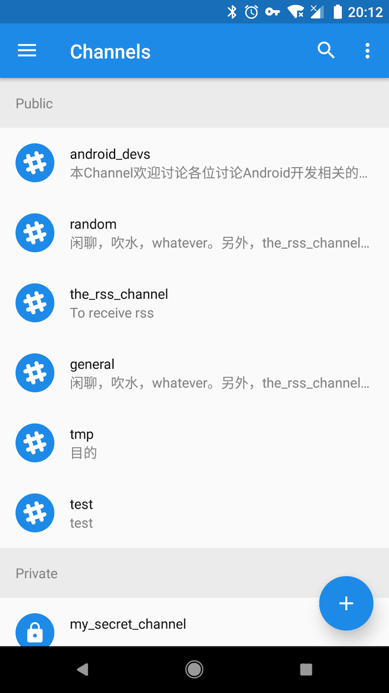
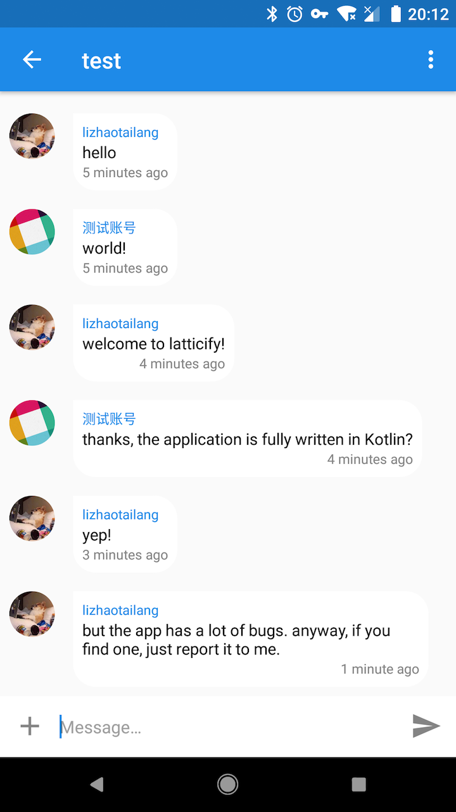
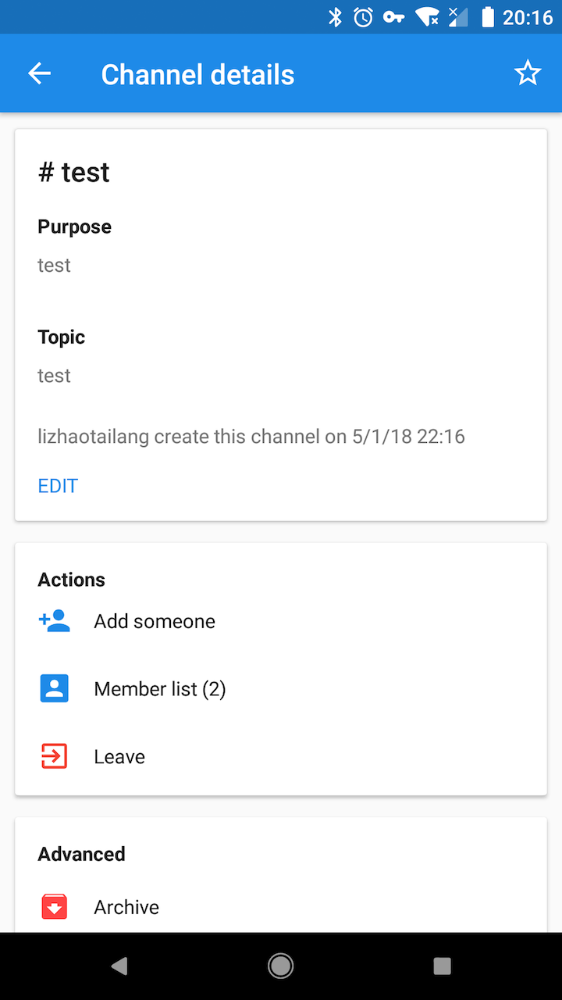
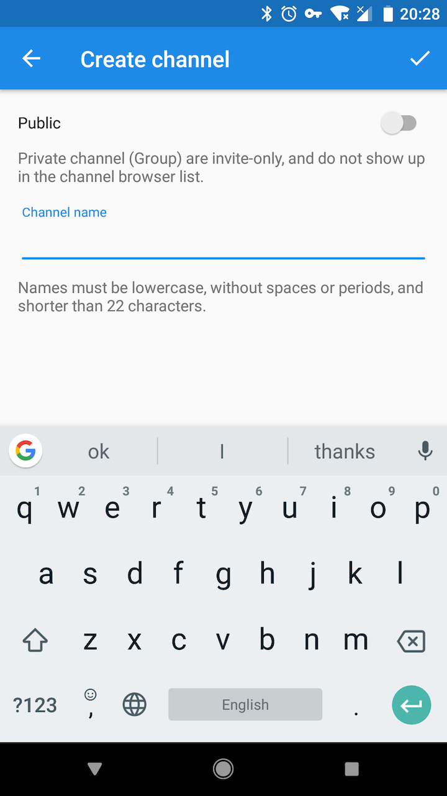
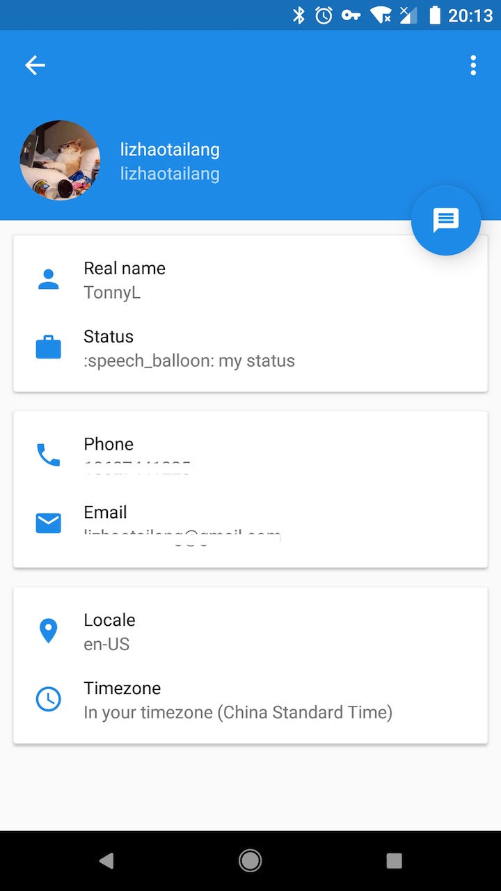
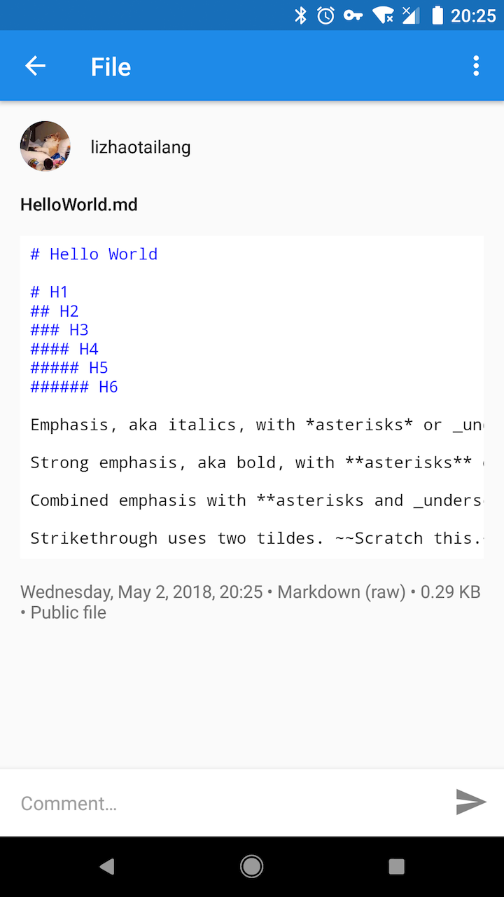

# 💬 Latticify(Work-in-progress)
[](https://travis-ci.org/TonnyL/Latticify)

Latticify is an Android app for [Slack](https://slack.com/). It's still in its very early stages of development.

## ✨ Features
+ Entirely written in [Kotlin](https://kotlinlang.org/)
+ MVP (Model-View-Presenter) architecture
+ Applies ReactiveX ([RxKotlin](https://github.com/ReactiveX/RxKotlin))

## 🖼 Screenshots
|  Channel list  |  Channel  |  Channel details  |
| :-------------: | :-------------: | :-------------: |
|  |  |  |

|  Create a channel  |  User profile  |  File  |
| :-------------: | :-------------: | :-------------: |
|  |  |  |

## 🤔 What you can/can't do?
+ ✅ Log in to your team
+ ✅ Send/Edit/Pin a message in IM or channel
+ ✅ Upload images or files
+ ✅ Preview/Download a file
+ ✅ Search messages or files
+ ✅ Update your status
+ ✅ Create a new channel
+ ✅ Star a item
+ ✅ View someone's profile or the details of a channel
+ ✅ Leave or archive a channel, invite members to a channel
+ ✅ Edit the purpose and topic of a channel
+ ✅ List the directory/channels/IMs/starred items of yours
+ ❌ Log in to several teams
+ ❌ Invite members to a team
+ ❌ Change the snooze settings
+ ❌ Update your profile
+ ❌ Mention someone in a channel
+ ❌ Emoji
+ ❌ Slash commands
+ ❌ Kick somebody

⚠️⚠️⚠️ Latticify is still in its very early stages of development and it has a lot bugs, and the code sucks, make good preparations for trying to use it or explore the source code.

## 🛠 Build
### Download the Source Code
```shell
git clone https://github.com/TonnyL/Latticify.git
```

### Setup API Keys
You need to register your application at [Slack API home](https://api.slack.com/). You can find information about how to gain access via the relevant links.

When you obtain the keys, you need to place them into the `latticify.properties` file.

```java
CLIENT_ID=<YOUR CLIENT ID>
CLIENT_SECRET=<YOUR CLIENT SECRET>
VERIFICATION_TOKEN=<YOUR VERIFICATION TOKEN>
```

⚠️ Notice: The `latticify.properties` file is not committed to git, so you need to create it manually.

As for *Callback URL*, you need to define your own url and then modify relative constants in [Api.kt](./mobile/src/main/java/io/github/tonnyl/latticify/retrofit/Api.kt).

### Open the Project in Android Studio
Open the `Latticify/` directory in Android Studio.

### Get Started
```shell
./gradlew build
```

### Troubleshooting
+ Update Android Studio to latest version.
+ Update Kotlin to latest version.
+ Try to clean the project and rebuild it.
+ If none of the solutions above, file an issue or email me.

## 💪 Contributing
Discussions and pull requests are welcomed.

## 📚 License
Latticify is under an MIT license. See the [LICENSE](LICENSE) file for more information.
